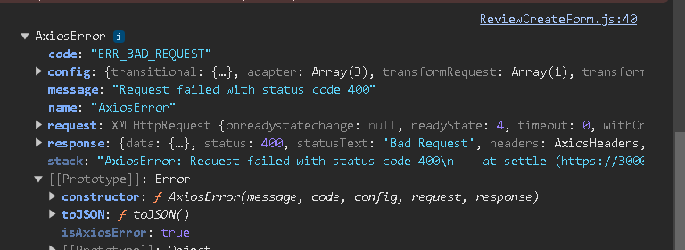

# Virtual Art Gallery - API

Virtual Art Gallery is a social media site for visual artists, digital creators and art enthusiasts. The site allows for individual users to create their own user profiles, publish their oen unique artwork and follow other artists and profiles. This documentation describes the API for this site and how the backend functionality for the app was developed and how it is utilised.

## Site Goals

The goal of this site is to connect people with similar interests in visual art and let them share ideas, build networks and comment, like and review each others work.  

### The API models

This API consists of 8 models which are wired to the front end architecture to provide a good user experience. These models will be described in greater detail later in this documentation and their front end representation is described in the documentation for the ReactJS app.
- [Link]()

## The Agile Method     

This project was developed using the Agile method to achieve a good workflow.
All the User stories in the Kanban board are associated to their respective Epics.
They are also labelled according to their MoSCoW prioritisation index: Must-have, Should-have, Could-have and Won't-have. 

The Kanban board was created wit Github Projects. You can find the link to it [here](https://github.com/Dym077/drf-api02/projects?query=is%3Aopen) 
The board is complete with all User stories having their acceptance criteria displayed. 

## Planning and Deployment

I am using ERD's(Entity Relationship Diagrams) to plan and describe my database models. The original First ERD was made with each class defined in a separate model:

After getting some feedback on this first model, I instead tried to rebuild the database fromthis second ERD, where two or more classes were included in a model and then selected using a BooleanField:
 

### Epics

* As a **developer** I can **make sure that the project is well coded** so that **it runs without problems or bugs**

***App should run flawlessly locally

- Develop project
- Test project 
- Deploy project

* As a **developer** I can **create a profiles page ** so that **users can create their own profiles**

***Acceptance Criteria

- A profile image
- Biography
- Add posts
- Edit posts

* As a **developer** I can **create a profiles page ** so that **users can create their own profiles**

***Acceptance Criteria

- A profile image
- Biography
- Add posts
- Edit posts

* As a *developer** I can **let users follow other users** so that **they can build their social network**

***Acceptance Criteria

- Follow button
- Unfollow button

* As a **developer** I can **let users create their own posts** so that **other users can view, like and comment on them**

***Acceptance Criteria

- Add image field
- Edit posts text field
- Delete post 

* As a **developer** I can **create a comments section** so that **users can comment on posts**

***Acceptance Criteria

- Comment button
- Comment text field
- Edit comment button
- Delete comment button

* As a **developer** I can **create a like button** so that **users can like each others posts**

***Acceptance Criteria

- A like button
- Like post
- Unlike post

* As a **developer** I can **create an artists page** so that **users and artists can interact**

***Acceptance Criteria

- Artists can register a dedicated profile
- Artists can upload images in high resolution
- Artists can interact with eachother and other users

* As a **developer ** I can **build a review function** so that **users can review the featured artists work**

***Acceptance Criteria

- A field for a short review.
- A favourite marker function

* As a developer I can publish the finished project so that other users can utilise all the features.

**Acceptance criteria

- Project is ready for publishing 

* As a developer I can make an early deployment of the project so that I can see that it works properly

**Acceptance criteria

- Deploy an early version of the project

### User Stories

* As a **user** I can **view posts by a specific user or artist** so that **I can keep myself updated about them**

***Acceptance Criteria

- View profiles by users and artists
- Gain access to the user's posts and bio

* As a **user ** I can **view post by other users and artists** so that **I can get acquainted with them**

***Acceptance Criteria

- View all posts by users and artists
- Infinite scroll on page
- Ability to comment and like posts

* As a **user** I can **create my own unique profile** so that **I can get access to all the features on the site**

***Acceptance Criteria

- Create unique username
- Create unique password
- Login and logout function

* As a **user** I can **gain new followers ** so that **I can extend my social network**

***Acceptance Criteria

- Other users can follow profiles
- Other users can view profile

* As a **logged in user ** I can **follow other profiles** so that **I can extend my social network**

***Acceptance Criteria

- Ability to follow other profiles
- Ability to unfollow other profiles

* As a **user** I can **create new posts** so that **other users can view them**

***Acceptance Criteria

- User can upload image
- User can describe the image
- Other users can see the post

* As a **logged in user** I can **delete my posts** so that **others can't view them**

***Acceptance Criteria

- A delete function
- Selected post and related media will be deleted
- Other user won't be able to view the post

* As a user I can edit my post title and description so that I can update or correct the post according to accuracy

***Acceptance Criteria

- Edit button
- Save changes button
- Edit text field
- Edit title field

* As a logged in user I can view posts filtered by other users so that I can be updated about their activities

***Acceptance Criteria

- Filter function
- Activities feed visible when logged in
- Feed showing accurate content, based on users being followed

* As a logged in user I can view posts and artwork I liked so that I can collect them in my feed

***Acceptance Criteria

- Posts liked showing up in users feed
- Unliked posts disappearing from the feed

* As a user, I can use keywords, so that I can find the artwork and profiles I look for.

***Acceptance Criteria

- Search field accepting keywords
- Results responding to typed in keywords
- Results available in feed

 * As a logged in user I can view details of a post so that I can learn about the creation of a specific piece of art

***Acceptance Criteria

- Details field available in post
- Click view details

* As a **logged in user** I can **like other users posts** so that **I can keep them in my feed and they can see my likes**

***Acceptance Criteria

- A like button 
- Liking a post will make the logged in users likes to update
- Liking a post will make the user who's post has been liked to be alerted
- The post-liking integer will increase by one

* As a **logged in user** I can **click the like button** so that **a liked post will become unliked**

***Acceptance Criteria

- Clicking the like button on a previously liked post will make the post unliked
- The post-liking integer will decrease by one

* As a **logged in user** I can **comment on other users' posts** so that **I can interact with them**

***Acceptance Criteria

- Toggle comment button
- Type comment in text field
- Publish comment button 
 
* As a **user** I can **edit my own comments** so that **I can correct the coment if necessary**

***Acceptance Criteria

- Toggle edit comment button
- Edit comment in text field
- Toggle save comment button

* As a **user** I can **delete my own comments** so that **it will be totally removed**

***Acceptance Criteria

- Toggle delete comment button
- Accept query to remove comment
- Comment will be removed

* As a **user** I can **view other users comments** so that **I can get feedback on my posts**

***Acceptance Criteria

- View comments on selected post
- Toggle comments icon

* As a **user** I can **comment on my own posts** so that **other users can view them**

***Acceptance Criteria

- Toggle comment icon
- Add new comment in text field
- Save comment

* As a **user** I can **view date and time on comments** so that **I know when the comment was published or edited**

***Acceptance Criteria

- Date and time visible on comment
- Date and time gets updated when comment gets edited

* As an **artist** I can **create a unique profile** so that **other users can view and comment on my work**

***Acceptance Criteria

- Create an artist profile
- Share contact details
- Upload high resolution images

* As a **user** I can **view an artists profile** so that **I can get more info about them**

***Acceptance Criteria

- View an artist profile
- Scroll through an artists work

* As a **user** I can **comment on a specific artists work** so that **the artist can receive feedback**

***Acceptance Criteria

- Toggle comment button
- Type comment in text field
- Save comment

* As a **user** I can **like a specific artists work** so that **they can receive feedback**

***Acceptance Criteria

- Like button
- Like integer will increase by on
- Artist can see like

* As a **user** I can **unlike a specific artists work** so that **only liked artwork will appear in my feed**

***Acceptance Criteria

- Click unlike on a previously liked artwork
- Like integer will decrease by one

* As a **logged in artist** I can **edit my own profile** so that **I can update my personal info and other users can view them**

***Acceptance Criteria

- Toggle edit personal info 
- Edit details in text field
- Save personal info

* As a **user** I can **change my username and password** so that **I can keep my personal details safe**

***Acceptance Criteria

- Change username
- Change password
- Save changes

* As a user I can change my profile image so that other users can view the updated picture

- Change profile image
- Upload image 
- Save changes

* As a logged in artist I can change my profile image so that other users can view the new picture

- Change profile image
- Upload new image 
- Save changes

* As a user I can view a favicon in the browser tab so that I easily can organise my browser tabs

- Unique favicon visible in a browser tab
- User can view the favicon in browser

* As a logged in user I can access a chat function in the browser so that I can communicate with other users

- Open a chat window
- Type chat message in window
- Toggle send message

* As a user I can view the logged out view so that I can choose to sign in 

- Logged out view visible in browser
- User can log in with username an password
- Unregistered user can choose to sign up
- New user chooses a unique username
- New user chooses a unique password
- New user will be asked to confirm password

* As a **user ** I can **view the most popular profiles** so that **I can choose who to follow**

***Acceptance Criteria

- Popular profiles visible in browser
- User can click on popular profiles
- User can follow popular profiles

* As a **user** I can **view my profile page** so that **I can see my image, my followers, likes, posts and who I'm following**

***Acceptance Criteria

- View users own profile page
- View users profile image
- View users followers
- View users likes
- View the profiles followed
- View the users following

* As a user I can navigate the home page so that I can view the posts in the feed

- User navigates to the home page
- User can utilise the infinite scroll function to view posts
- User can reach other menues from the home page 

* As a user I can view the date on which a specific post was published so that I keep track of new posts

- Date of publishing will be visible on specific post

* As a user I can click the logotype so that I can navigate to the home page

- Logotype will be visible in navigation bar
- User can click on the logotype
- User will navigate to the homepage

* As a user I can click on another user's avatar so that I can view their profile

- Click on a user's avatar/ profile image
- Navigate to the profile page
- View the user's profile

* As an artist I can specify techniques, dimensions and price on my artwork so that other users can view them

- Artist can specify the technique used on specific artwork
- Artist can specify the dimensions on their artwork
- Artist can specify the price of the artwork

* As a user I can see a date and time on my comment so that I can see when a comment on my post was published

- A date and time stamp will be published together with the specific comment
- The date and time will be visible to logged in users viewing the comment

* As a user I can contact the the site owner so that I can get help with any issues

- The site owners admin contact details are available to the user
- The user can reach out to the admin to get help with log in issues, profile or post issues or  
  any other isues related to the site.
- The site admin/ owner will respond accordingly

* As a user I can create a unique username and password so that I can log onto the site

- User can create a username
- User can create a password
- User can log in with these credentials

* As a user I can use the navigation bar so that I can navigate between the views easily

- All menues are visible in the navigation bar
- User can click on the menues in the navigation bar
- The selected view will be visible to the user

### Using MosSCoW Prioritisation:

All the User Stories are sorted according to their prioritisation index, using the MoSCoW method.
By applying this method, it is easer to choose which features will be implemented first while prioritising them by their level of importance.

* Must-Have: These features are essential for the application and cannot be left out.
* Should-Have: Features that are valuable for the application but not essential.
* Could-Have: Nice features that can be implemented if the deadline allows it.
* Won't-Have: Features that most likely won't be implemented in this project.

## Technologies
* Python
* Django (Django REST Framwork)

## Testing

### Manual Testing

A series of manual tests were utilized to check all endpoints. 
The full documentation of the manual testing can be found via this link:
- [Testing](./TESTING.md)

#### Python Testing
All python code was tested using [CI Python Linter](https://pep8ci.herokuapp.com/)

- `drf_api1/permissions.py`: no errors
- `drf_api1/seriailizers.py`: no errors
- `drf_api1/settings.py`: no errors
- `drf_api1/urls.py`: no errors
- `drf_api1/views.py`: no errors

- `followers/apps.py`: no errors
- `followers/models.py`: no errors
- `followers/serializers.py`: no errors
- `followers/urls.py`: no errors
- `followers/views.py`: no errors

- `likes/apps.py`: no errors
- `likes/models.py`: no errors
- `likes/serializers.py`: no errors
- `likes/urls.py`: no errors
- `likes/views.py`: no errors

- `posts/apps.py`: no errors
- `posts/models.py`: no errors
- `posts/serializers.py`: no errors
- `posts/urls.py`: no errors
- `posts/views.py`: no errors

- `profiles/admin.py`: no errors
- `profiles/apps.py`: no errors
- `profiles/models.py`: no errors
- `profiles/serializers.py`: no errors
- `profiles/urls.py`: no errors
- `profiles/views.py`: no errors

- `reviews/admin.py`: no errors
- `reviews/apps.py`: no errors
- `reviews/models.py`: no errors
- `reviews/serializers.py`: no errors
- `reviews/urls.py`: no errors
- `reviews/views.py`: no errors

The CI Python Linter returns some suggestions considering whitespaces and new lines.
These suggestions can be safely ignored, as the code will still run without errors.

#### Found bugs while testing
- 
One of the most frustrating bugs I encountered during development and testing of the API, was an axioserror which was related to the "reviews" model. When attempting to post a review from the ReviewCreateForm on selected artwork, the devtools console returned "AxiosError Bad Request" For some reason, the front end could not communicate at all with the API.
The reason for this bug was in the front end of this project. Because there were only one field for the review implemented, and the API requires four fields, the digital handshake could not be executed properly.

- When changing the default profile image, the API and CLoudinary occasionally won't connect properly. To prevent the avatar image from being absent, I used this command ocated in the folder "management/commands" to update the profile images. 

#### Fixed bugs

- The DOM returns a NaN message when a user submits a comment on another user's post. The reason for this error is not to be found in the front end, but should be caused when the integer from the API isn't properly read by the DOM, believing it to be a string rather than an integer. The culprit was revealed to be the serializer in the Postserializer model for the backend API missed a comments_count field so the Post model was not annotated with comments_count field. Thanks to help from tutor support we were able to pinpoint this bug and fix it.

#### Unresolved bugs

- The browser should return alerts when a review form isn't properly filled out.
Mandatory fields such as "title" and "rating" returns no visible alerts to the user - the form will just not be published or updated.
- The rating system currently returns no alerts if the user enters an integer larger than 5 or smaller than 1.

## Heroku Deployment

The site was deployed to Heroku. These are the steps to do this:

* Navigate to heroku and create an account
* Click on the "new" button
* Select "create new app"
* Give your app a name
* Select region and click "create app"
* Choose the "settings" tab and click "Reveal Config Vars" to set Your variables

| Key | Value |
| --- | --- |
| `CLOUDINARY_URL` | exclusive to the user |
| `DATABASE_URL` | exclusive to the user |
| `DISABLE_COLLECTSTATIC` | 1 (*not needed for the final deployment*) |
| `SECRET_KEY` | exclusive to the user |

To deploy properly, Heroku needs two additional files:
- requirements.txt
- Procfile

To install Your project's **requirements**, and You already have them in a requirements.txt-file, You can use the terminal command
- `pip3 install -r requirements.txt`

If You have dependencies that have been installed, You can collect them in Your requirements.txt using this command:
- `pip3 freeze --local > requirements.txt`

The Procfile can be created either by right-clicking in the base dir and select "New file" and naming the file "Procfile"(please note that there is no file extension), or by using the termial command:
- `echo web: gunicorn app_name.wsgi > Procfile`
- *replace **app_name** with the name of your primary Django app name; the folder where settings.py is located*

* Click the "deploy" tab
* Scroll down to "Connect to GitHub" 
* In the search box, choose your repositoy and click "connect"
* Go to "Manual deploy" and choose "main branch"
* Click deploy

 
The live link can be found here: 

## Version Control

## Credits

### Online resources
! [Stack Overflow](https://stackoverflow.com/)
! [Django Documentation](https://docs.djangoproject.com/en/5.0/)
! 

## Frameworks, libraries and dependencies used
The Virtual Art Gallery API is built in Python using [Django](https://www.djangoproject.com) and [Django Rest Framework](https://django-filter.readthedocs.io/en/stable/).

In addition, there were some extra tools, that made the implementationpossible:

### django-cloudinary-storage
https://pypi.org/project/django-cloudinary-storage/

This service provides storage of profile images and uploaded images to cloudinary.

### dj-allauth
https://docs.allauth.org/en/latest/

This service is for providing secure user authentication.

### dj-rest-auth
https://dj-rest-auth.readthedocs.io/en/latest/

Used for login and logout in REST.

### djangorestframework-simplejwt
https://django-rest-framework-simplejwt.readthedocs.io/en/latest/

Provides the JSON web token authentication.

### dj-database-url
https://pypi.org/project/dj-database-url/

Builds the variable to configure a connection to the backend.

### psychopg2
https://pypi.org/project/psycopg2/

Db adapter to ake sure theat Python and the PostgreSQL database make the digital handshake.

Note that the above listed dependencies were used in concert with versions that don't create any conflicts in the application. The version used can be found in [requirements.txt.]

### Content

### Acknowledgements

* My Mentor Jubril Akolade.
* The Tutor Team at Code Institute for going above and beyond to help me.
* The Slack community which has provided invaluable resources and support.
* My friends that have supported me through the process.
