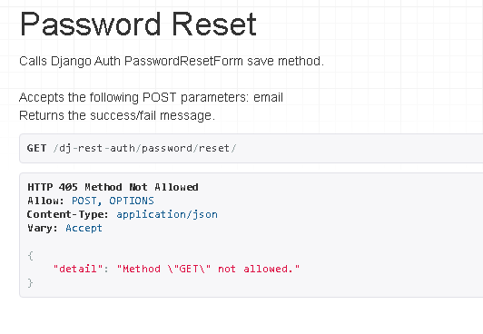

# Virtual Art Gallery DRF-API Manual Testing

## Methodology

By going through the user stories one by one, we should be able to assure that all functions are working as expected.
Therefor, a series of tests have been performed below.

Write review on posts:

**Acceptance Criteria
- Toggle review button
- Type content in text field
- Add a rating between 1 & 5
- Publish review button

    

* Edit Review
***Acceptance Criteria

 - Toggle edit review button
 - Edit review in text field
 - Toggle save review button
 - Reviews count increases by 1
 - Rating will increase or decrease

    

* Delete Review
***Acceptance Criteria

- Toggle delete review button
- Accept query to remove review
- Review will be removed

    

    

    

    

    

    

    

    

    

    

    

    

    

    

    

    

    

    

    

    

    

    

    

    

    

    

    

    

    

| Test Case | Description | Result | Comments |
|-----------|-------------|--------|----------|