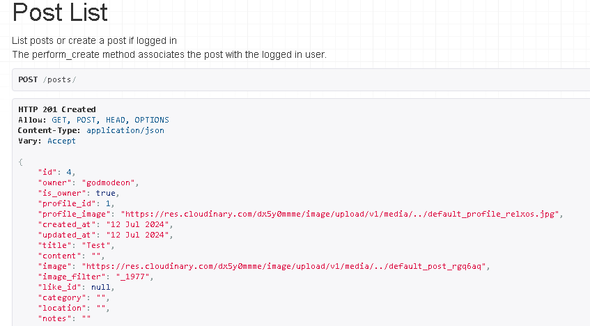

# Virtual Art Gallery DRF-API Manual Testing

## Methodology

For this documentation, a series of tests were performed to try all the endpoints of this application.
The purpose for this is to ensure that all functions of this application work as intended and that if any unauhorized or unexpected operations are performed, an appropriate error message or alert will appear.

This iteration of the Virtual Art Gallery API should provide for a new user to sign up and create a profile using valid credentials, write a bio, upload their own artwork with specifications as well as like and write reviews on other users artwork. Users should also be able to edit their profiles and delete their posts and reviews. By providing full CRUD functionality to an application like this, it's vital to ensure that all endpoints work as expected. 

By referencing the user stories in the Project kanban one by one, we should be able to identify all the intended functionality.
All tests were performed using the Django Rest Framework HTML interface running on a test server.

* Write review on posts:

**Acceptance Criteria
- Toggle review button
- Type content in text field
- Add a rating between 1 & 5
- Publish review button

This also relates to the original user story, which allowed users to comment on their own posts.
Comments were later changed to Reviews.

* As a user I can comment on my own posts so that other users can view them

***Acceptance Criteria

 Toggle comment icon
 Add new comment in text field
 Save comment

    

* Edit Review
***Acceptance Criteria

 - Toggle edit review button
 - Edit review in text field
 - Toggle save review button
 - Reviews count increases by 1
 - Rating will increase or decrease

    

- If content field is not filled in, a 400 alert will return. 

    

- If an integer between 1 & 5 is not assigned, a 400 error will throw.

    

- Title and tags are not mandatory, just content and rating.

    

- A review with all fields filled out

    

* Delete Review
***Acceptance Criteria

Toggle delete review button
Accept query to remove review
Review will be removed

    

* As a user I can create a unique username and password so that I can log onto the site

***Acceptance Criteria

 User can create a username
 User can create a password
 User can log in with these credentials

- If the credentials are invalid, the database will return the following json message:

    

- Returned when a user is logged out:

    

- When a user is requesting a password reset:
 There's no reset email sent, however.

    

- If a user wishes to change password, the database returns a 200 message:

    

- If a user types types an invalid password in one of fields, the database returns a 400 error:

    

- If a field is empty, the database will return a 400 error with an appropriate message saying that he field cannot be blank:

    

- A new registered user can register with a username and password. Email and full name is not necessary.

    

- A new user cannot register, without entering a username or a valid password.

    

- If a user enters a password that is too common ot too short, the database will return a 400 error message, and a hint that 
the password is too common or too short.

    

- When a user chooses to follow another user, the field named "followed" will increase by one integer and the database will 
answer with a 200 created. 

* As a **logged in user ** I can follow other profiles so that I can extend my social network

***Acceptance Criteria

 Ability to follow other profiles
 Ability to unfollow other profiles

    

- When a user stops following another user, the database will respond with 204 no content and.

    

* As a user I can like a specific artists work so that they can receive feedback

***Acceptance Criteria

 Like button
 Like integer will increase by on
 Artist can see like

    

* As a logged in user I can like other users posts so that I can keep them in my feed and they can see my likes

***Acceptance Criteria

 A like button
 Liking a post will make the logged in users likes to update
 Liking a post will make the user who's post has been liked to be alerted
 The post-liking integer will increase by one

- When a user likes another users post, the json message returns the id of the post and an appropriate message 201 created.

    

* As a logged in user I can click the like button so that a liked post will become unliked

***Acceptance Criteria

 Clicking the like button on a previously liked post will make the post unliked
 The post-liking integer will decrease by one

- If a user unlikes a post the like id will be deleted from the database which wil return the json message and 204 no content.

    

- When a user uploads a new posts, all the fields that are filled out will be visible in the json message and a 201 created message will be returned. The profile id of the user will also e displayed.

    

- Note that not all fields are mandatory:

    

* As a logged in user I can delete my posts so that others can't view them

***Acceptance Criteria

 A delete function
 Selected post and related media will be deleted
 Other user won't be able to view the post

- When a post is deleted, the appropriate 204 message will be returned:

    

* As a user I can edit my post title and description so that I can update or correct the post according to accuracy

***Acceptance Criteria

 Edit button
 Save changes button
 Edit text field
 Edit title field

- If a user edits and updates a post, the database will return a 200 OK message.

    

- The only two mandadatory fields when creating a new post, are title and the image field. The database will return a 201 created.

    

* As a user I can change my profile image so that other users can view the updated picture

 Change profile image
 Upload image
 Save changes

- If a user wishes to update the profile, the database will return the new values with a 200 message:

    

- Profile list:
When calling the profiles extention, all profiles registered in the database should be 
displayed. To the user, this will be translated as the profiles avatars in the browser.

As a **user ** I can view the most popular profiles so that I can choose who to follow

***Acceptance Criteria

 Popular profiles visible in browser
 User can click on popular profiles
 User can follow popular profiles

    

- If the user is looking for a profile that doesn't exits, the database will respond with a 400 message.
This is also the case if a user chooses to have the profile deleted:

    

Further documentation and validation of this app can be read in the [README.md](https://github.com/Dym077/drf-api02/blob/main/README.md) for this API and the [README.md](https://github.com/Dym077/virtual-gallery/blob/main/README.md) for the front end appplication for [Virtual Art Gallery](https://github.com/Dym077/virtual-gallery).