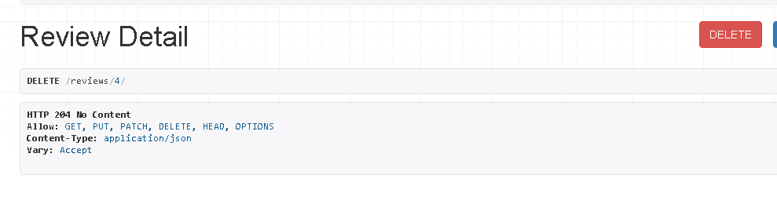

# Virtual Art Gallery DRF-API Manual Testing

## Methodology

By going through the user stories one by one, we should be able to assure that all functions are working as expected.
Therefor, a series of tests have been performed below.

Write review on posts:

**Acceptance Criteria
- Toggle review button
- Type content in text field
- Add a rating between 1 & 5
- Publish review button

    

* Edit Review
***Acceptance Criteria

 - Toggle edit review button
 - Edit review in text field
 - Toggle save review button
 - Reviews count increases by 1
 - Rating will increase or decrease

    

- If content field is not filled in, a 400 alert will return. 

    

- If an integer between 1 & 5 is not assigned, a 400 error will throw.

    

- Title and tags are not mandatory, just content and rating.

    

- A review with all fields filled out

    

* Delete Review
***Acceptance Criteria

- Toggle delete review button
- Accept query to remove review
- Review will be removed

    

* As a user I can create my own unique profile so that I can get access to all the features on the site

***Acceptance Criteria

 Create unique username
 Create unique password
 Login and logout function

    

 

    

- Returned when a user is logged out:

    

- When a user is requesting a password reset:
 There's no reset email sent, however.

    

- If a user wishes to change password, the database returns a 200 message:

    

- If a user types types an invalid password in one of fields, the database returns a 400 error:

    

- If a field is empty, the database will return a 400 error with an appropriate message saying that he field cannot be blank:

    

- A new registered user can register with a username and password. Email and full name is not necessary.

- A new user cannot register, without entering a username or a valid password.

    

- If a user enters a password that is too common ot too short, the database will return a 400 error message, and a hint that 
the password is too common or too short.

    

- When a user chooses to follow another user, the field named "followed" will increase by one integer and the database will 
answer with a 200 created. 

    

- When a user stops following another user, the database will respond with 204 no content and.

    

- Likes

    

- When a user likes another users post, the json message returns the id of the post and an appropriate message 201 created.

    

- If a user unlikes a post the like id will be deleted from the database which wil return the json message and 204 no content.

    

- When a user uploads a new posts, all the fields that are filled out will be visible in the json message and a 201 created message will be returned. The profile id of the user will also e displayed.

    

- Note that not all fields are mandatory:

    

- When a post is deleted, the appropriate 204 message will be returned:

    

- If a user edits and updates a post, the database will return a 200 OK message.

    

- The only two mandadatory fields when creating a new post, are title and the image field. The database will return a 201 created.

    

* As a user I can change my username and password so that I can keep my personal details safe

***Acceptance Criteria

 Change username
 Change password
 Save changes

- If a user wishes to update the profile, the database will return the new values with a 200 message:

    

- Profile list:

    

- If the user is looking for a profile that doesn't exits, the database will respond with a 400 message.
This is also the case if a user chooses to have the profile deleted:

    

| Test Case | Description | Result | Comments |
|-----------|-------------|--------|----------|